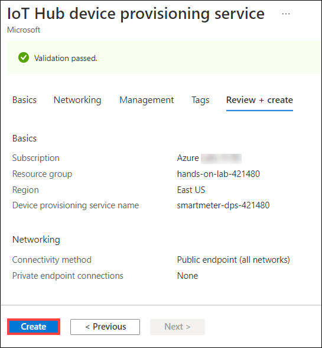

## Exercise 1: IoT Hub and Device Provisioning Service deployment

Duration: 30 minutes

In your architecture design session with Fabrikam, it was agreed upon to use Azure Device Provisioning Service (DPS) to manage automatic device registration. The DPS would then assign an IoT Hub to the device that ingests telemetry from the Smart Meter Simulator. In this exercise, you will deploy an IoT Hub and DPS to enable device registration and connectivity.

### Task 1: Provision the IoT Hub

In these steps, you will provision an instance of IoT Hub.

1. In your browser, navigate to the [Azure portal](https://portal.azure.com), select **+Create a resource** in the navigation pane, enter _IoT Hub_ into the **Search the Marketplace** box, and select **IoT Hub** from the results.

   

2. On the resource overview page, select **Create**.

3. On the **IoT Hub** screen, **Basics** tab, enter the following:

   - **Subscription**: Select the subscription you are using for this hands-on lab.

   - **Resource group**: Choose Use existing and select the **hands-on-lab-SUFFIX** resource group.

   - **Region**: Select the location you are using for this hands-on lab.

   - **IoT Hub Name**: Enter a unique name, such as **smartmeter-hub-SUFFIX**.

     

4. Select the **Management** tab. Accept the default Pricing and scale tier of **S1: Standard tier**, and select **Review + create**.

    

5. Once validation has passed, select **Create**.

    
  
6. When the IoT Hub deployment is completed, you will receive a notification in the Azure portal. Select **Go to resource** in the notification.

   

7. From the **IoT Hub's Overview** blade, select **Shared access policies** under **Settings** on the left-hand menu and select **iothubowner** policy.

   

8. In the **iothubowner** blade, select the **Copy** button to the right of the **Connection string - primary key** field. Record this value for a future task.

   

### Task 2: Deploy the Device Provisioning Service

In these steps, you will deploy an instance of the Device Provisioning Service (DPS).

1. In your browser, navigate to the [Azure portal](https://portal.azure.com), select **+Create a resource** in the navigation pane, enter `IOT Hub Device Provisioning Service` into the **Search the Marketplace** box, and select **IoT Hub** from the results.

    

2. On the resource overview page, select **Create**.

    

3. On the IoT Hub device provisioning service **Basics** tab, complete the form as follows:

   - **Subscription**: Select the subscription you are using for this hands-on lab.

   - **Resource group**: Choose Use existing and select the **hands-on-lab-SUFFIX** resource group.

   - **Name**: Enter a unique name, such as **smartmeter-dps-SUFFIX**.

   - **Region**: Select the location you are using for this hands-on lab.

    

4. Select **Review + create**, then once validation has passed, select **Create** once more to deploy the service.

    

5. When the DPS deployment is completed, select **Go to resource** on the deployment screen.

    

6. On the Overview screen of the Device Provisioning Service, copy and record the value for **ID Scope** for a future task.

    

### Task 3: Link the IoT Hub to the Device Provisioning Service

1. Remaining in the DPS resource, select **Linked IoT hubs** from the left menu, located beneath the **Settings** heading. Then select **+Add** from the toolbar.

    

2. In the Add link to IoT hub blade, populate the form as follows, then select **Save**:

   - **Subscription**: Select the subscription you are using for this hands-on lab.
   - **IoT Hub**: Select the **smartmeter-hub-{SUFFIX}** IoT Hub.
   - **Access Policy**: Select **iothubowner**.

    

### Task 4: Create an enrollment group

Creating an enrollment group enables Fabrikam to allow devices to self-register. This avoids the need to register each device manually. Group enrollments are made possible via secure Attestations, these could be via certificates or symmetric keys. In this example, we will use the symmetric key approach. Using symmetric keys should only be used in non-production scenarios, such as with this proof of concept.

1. Remaining in the DPS resource, select **Manage enrollments** from the left menu, then select **+Add enrollment group** from the toolbar menu.

    

2. In the Add Enrollment Group form, populate it as follows, then select the **Save** button.

    - **Group name**: Enter **smartmeter-device-group**.
    - **Attestation Type**: Select **Symmetric Key**.
    - **Auto-generate keys**: Checked.
    - **IoT Edge device**: Select **False**.
    - **Select how you want to assign devices to hubs**: Select **Evenly weighted distribution**.
    - **Select the IoT hubs this group can be assigned to**: Select **smartmeter-hub-{SUFFIX}**.
    - **Select how you want the device data to be handled on re-provisioning**: Select **Re-provision and migrate data**.
    - **Initial Device Twin State**: Retain the default value.
    - **Enable entry**: Select **Enable**.
  
   

3. Select the newly created enrollment group from the **Enrollment Groups** list.

   

4. On the Enrollment Group Details screen, copy the **Primary Key** value and record it for a future task.

    
