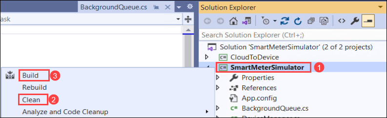
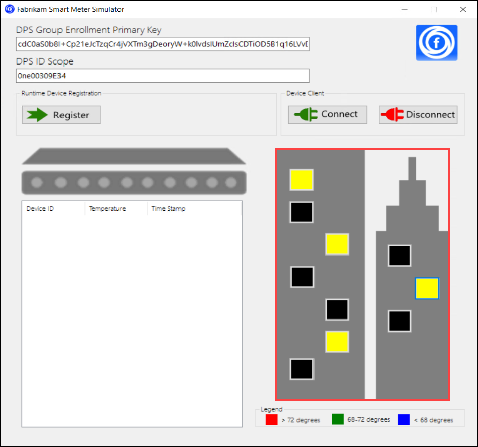
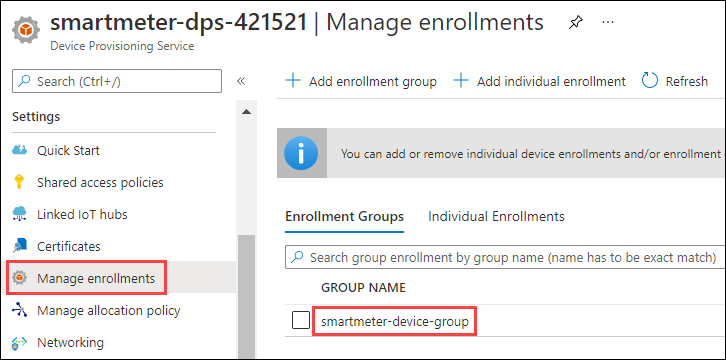
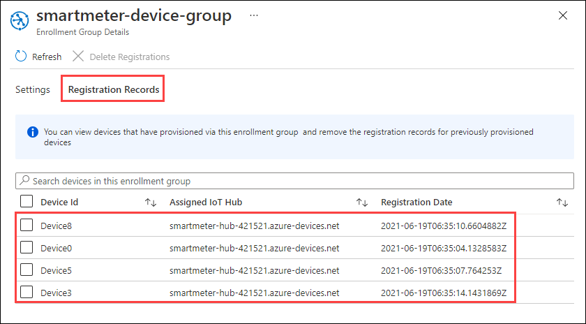

## Exercise 2: Completing the Smart Meter Simulator

Duration: 60 minutes

Fabrikam has left you a partially completed sample in the form of the Smart Meter Simulator solution. You will need to complete the missing lines of code that deal with device registration management and device telemetry transmission that communicate with your IoT Hub.

### Task 1: Implement device management with the IoT Hub

1. In **Visual Studio** on your **Lab VM**, use **Solution Explorer**, navigate go to **C:\SmartMeter\MCW-Internet-of-Things-main\Hands-on lab\lab-files\starter-project** and open the file **DeviceManager.cs**.

2. From the Visual Studio **View** menu, choose **Task List**.

   

3. In the **Task List**, you will see a list of **TODO** tasks, where each task represents one line of code that needs to be completed. Complete the line of code below each **TODO** using the code below as a reference. If your task list is blank, complete TODO steps 1-5 as indicated in the code in the next step.

4. The following code represents the completed tasks in **DeviceManager.cs**:

   ```csharp
    using System;
    using System.Security.Cryptography;
    using System.Text;
    using System.Threading.Tasks;
    using Microsoft.Azure.Devices.Provisioning.Client;
    using Microsoft.Azure.Devices.Provisioning.Client.Transport;
    using Microsoft.Azure.Devices.Shared;

    namespace SmartMeterSimulator
    {
        class DeviceManager
        {            
            /// <summary>
            /// Register a single device with the device provisioning service.
            /// </summary>
            /// <param name="enrollmentKey">Group Enrollment Key</param>
            /// <param name="idScope">DPS Service ID Scope</param>
            /// <param name="deviceId">Device Id of the device being registered</param>
            /// <returns></returns>
            public async static Task<SmartMeterDevice> RegisterDeviceAsync(string enrollmentKey, string idScope, string deviceId)
            {
                var globalEndpoint = "global.azure-devices-provisioning.net";
                SmartMeterDevice device = null;
                
                //TODO: 1. Derive a device key from a combination of the group enrollment key and the device id
                var primaryKey = ComputeDerivedSymmetricKey(enrollmentKey, deviceId);

                //TODO: 2. Create symmetric key with the generated primary key
                using (var security = new SecurityProviderSymmetricKey(deviceId, primaryKey, null))
                using (var transportHandler = new ProvisioningTransportHandlerMqtt())
                {
                    //TODO: 3. Create a Provisioning Device Client
                    var client = ProvisioningDeviceClient.Create(globalEndpoint, idScope, security, transportHandler);

                    //TODO: 4. Register the device using the symmetric key and MQTT
                    DeviceRegistrationResult result = await client.RegisterAsync();

                    //TODO: 5. Populate the device provisioning details
                    device = new SmartMeterDevice()
                    {
                        AuthenticationKey = primaryKey,
                        DeviceId = deviceId,
                        IoTHubHostName = result.AssignedHub
                    };
                }
                
                //return the device
                return device;
            }

            /// <summary>
            /// Compute a symmetric key for the provisioned device from the enrollment group symmetric key used in attestation.
            /// </summary>
            /// <param name="enrollmentKey">Enrollment group symmetric key.</param>
            /// <param name="deviceId">The device Id of the key to create.</param>
            /// <returns>The key for the specified device Id registration in the enrollment group.</returns>
            /// <seealso>
            /// https://docs.microsoft.com/en-us/azure/iot-edge/how-to-auto-provision-symmetric-keys?view=iotedge-2018-06#derive-a-device-key
            /// </seealso>
            private static string ComputeDerivedSymmetricKey(string enrollmentKey, string deviceId)
            {
                if (string.IsNullOrWhiteSpace(enrollmentKey))
                {
                    return enrollmentKey;
                }

                var key = "";
                using (var hmac = new HMACSHA256(Convert.FromBase64String(enrollmentKey)))
                {
                    key = Convert.ToBase64String(hmac.ComputeHash(Encoding.UTF8.GetBytes(deviceId)));
                }

                return key;
            }
        }

    }
   ```

   >**Note**:  Be sure you only replace code in the **DeviceManager** class and not any other code in the file.

5. Save **DeviceManager.cs**.

### Task 2: Configure the DPS Group Enrollment Key and ID Scope

You will want to avoid entering the DPS Group Enrollment Key and ID Scope every time the project is run. To do this, you can set this value as the default text for the **DPS Group Enrollment Primary Key** and **DPS ID Scope** text boxes in the application. Follow these steps to configure the connection string:

1. Return to the **SmartMeterSimulator** solution in **Visual Studio** on your **Lab VM**.

2. In the **Solution Explorer**, expand the **SmartMeterSimulator** project and double-click **MainForm.cs** to open it. (If the Solution Explorer is not in the upper-right corner of your Visual Studio instance, you can find it under the View menu in Visual Studio.)

   

    > **Note**: If the file does not open. One of the project files may be blocked.

   - Open **Windows Explorer** and navigate to the starter project folder: **C:\SmartMeter\Hands-on lab\lab-files\starter-project\SmartMeterSimulator**.
   - Right-click on the **MainForm.resx** file, then select **Properties**.
   - Check the **Unblock** checkbox on the bottom of the **General** tab, then select **Apply** then **OK**.

   

   - Close and reopen **Visual Studio**. Re-open the **MainForm.cs** file.

    >**Note**: If you are still unable to see the Windows Forms designer, close it, then right-click the project and select **Clean**. Then, right-click the project again and select **Build**. Now, you should be able to open the form without a problem.
    >
    >    
  
3. In the **Windows Forms designer surface**, select the **DPS Group Enrollment Primary Key** textbox.

   

4. In the **Properties** panel, scroll until you see the **Text** property. Paste your **DPS Enrollment Group Primary Key** value copied from Exercise 1, Task 4, Step 4 into the value for the **Text** property. (If the properties window is not visible below the Solution Explorer, right-click the TextBox, and select **Properties**.)

   

5. Repeat steps 3 and 4 to populate the **DPS ID Scope** textbox with the value you recorded in Exercise 1, Task 2, Step 6.

6. Your DPS Group Enrollment Primary Key and ID Scope should now be present every time you run the **Smart Meter Simulator**.

   

7. Save **MainForm.cs**.

### Task 3: Implement the communication of telemetry with IoT Hub

1. Open **Sensor.cs** from the **Solution Explorer**, and complete the **TODO** items 6 to 11 as indicated within the code that are responsible for transmitting telemetry data to the IoT Hub, as well as receiving data from IoT Hub.

2. The following code shows the completed result:

   ```csharp
    using System;
    using System.Text;
    using Microsoft.Azure.Devices.Client;
    using Newtonsoft.Json;


    namespace SmartMeterSimulator
    {
        /// <summary>
        /// A sensor represents a Smart Meter in the simulator.
        /// </summary>
        class Sensor
        {
            private DeviceClient DeviceClient;
            private string IotHubUri { get; set; }
            public string DeviceId { get; set; }
            public string DeviceKey { get; set; }
            public DeviceState State { get; set; }
            public string StatusWindow { get; set; }
            public string ReceivedMessage { get; set; }
            public double? ReceivedTemperatureSetting { get; set; }
            public double CurrentTemperature
            {
                get
                {
                    double avgTemperature = 70;
                    Random rand = new Random();
                    double currentTemperature = avgTemperature + rand.Next(-6, 6);

                    if (ReceivedTemperatureSetting.HasValue)
                    {
                        // If we received a cloud-to-device message that sets the temperature, override with the received value.
                        currentTemperature = ReceivedTemperatureSetting.Value;
                    }

                    if (currentTemperature <= 68)
                        TemperatureIndicator = SensorState.Cold;
                    else if (currentTemperature > 68 && currentTemperature < 72)
                        TemperatureIndicator = SensorState.Normal;
                    else if (currentTemperature >= 72)
                        TemperatureIndicator = SensorState.Hot;

                    return currentTemperature;
                }
            }
            public SensorState TemperatureIndicator { get; set; }

            public Sensor(string deviceId)
            {
                DeviceId = deviceId;

            }

            public void SetRegistrationInformation(string iotHubUri, string deviceKey)
            {
                IotHubUri = iotHubUri;
                DeviceKey = deviceKey;
                State = DeviceState.Registered;
            }
            public void InstallDevice(string statusWindow)
            {
                StatusWindow = statusWindow;
                State = DeviceState.Installed;
            }

            /// <summary>
            /// Connect a device to the IoT Hub by instantiating a DeviceClient for that Device by Id and Key.
            /// </summary>
            public void ConnectDevice()
            {
                //TODO: 6. Connect the Device to Iot Hub by creating an instance of DeviceClient
                DeviceClient = DeviceClient.Create(IotHubUri, new DeviceAuthenticationWithRegistrySymmetricKey(DeviceId, DeviceKey));

                //Set the Device State to Ready
                State = DeviceState.Connected;
            }

            public void DisconnectDevice()
            {
                //Delete the local device client            
                DeviceClient = null;

                //Set the Device State to Activate
                State = DeviceState.Registered;
            }

            /// <summary>
            /// Send a message to the IoT Hub from the Smart Meter device
            /// </summary>
            public async void SendMessageAsync()
            {
                var telemetryDataPoint = new
                {
                    id = DeviceId,
                    time = DateTime.UtcNow.ToString("o"),
                    temp = CurrentTemperature
                };

                //TODO: 7.Serialize the telemetryDataPoint to JSON
                var messageString = JsonConvert.SerializeObject(telemetryDataPoint);

                //TODO: 8.Encode the JSON string to ASCII as bytes and create new Message with the bytes
                var message = new Message(Encoding.ASCII.GetBytes(messageString));

                //TODO: 9.Send the message to the IoT Hub
                var sendEventAsync = DeviceClient?.SendEventAsync(message);
                if (sendEventAsync != null) await sendEventAsync;
            }

            /// <summary>
            /// Check for new messages sent to this device through IoT Hub.
            /// </summary>
            public async void ReceiveMessageAsync()
            {
                if (DeviceClient == null)
                    return;

                try
                {
                    Message receivedMessage = await DeviceClient?.ReceiveAsync();
                    if (receivedMessage == null)
                    {
                        ReceivedMessage = null;
                        return;
                    }

                    //TODO: 10.Set the received message for this sensor to the string value of the message byte array
                    ReceivedMessage = Encoding.ASCII.GetString(receivedMessage.GetBytes());
                    if (double.TryParse(ReceivedMessage, out var requestedTemperature))
                    {
                        ReceivedTemperatureSetting = requestedTemperature;
                    }
                    else
                    {
                        ReceivedTemperatureSetting = null;
                    }

                    // Send acknowledgement to IoT Hub that the has been successfully processed.
                    // The message can be safely removed from the device queue. If something happened
                    // that prevented the device app from completing the processing of the message,
                    // IoT Hub delivers it again.

                    //TODO: 11.Send acknowledgement to IoT hub that the message was processed
                    await DeviceClient?.CompleteAsync(receivedMessage);
                }
                catch (Exception)
                {
                    // The device client is null, likely due to it being disconnected since this method was called.
                    System.Diagnostics.Debug.WriteLine("The DeviceClient is null. This is likely due to it being disconnected since the ReceiveMessageAsync message was called.");
                }
            }
        }


        public enum DeviceState
        { 
            New,    
            Installed,
            Registered,         
            Connected,
            Transmit
        }
        public enum SensorState
        {
            Cold,
            Normal,
            Hot
        }
    }

   ```

    > **Note**:  Be sure you only replace the **Sensor** class and not any other code in the file.

3. Save **Sensor.cs**.

### Task 4: Verify device registration and telemetry

In this task, you will build and run the Smart Meter Simulator project.

1. In **Visual Studio** select **Build** from the Visual Studio menu, then select **Build Solution**.

   

2. Run the **Smart Meter Simulator**, by selecting the green **Start** button on the Visual Studio toolbar.

   

3. Select one or more of the windows within the building to simulate the installation of a smart meter device. Once selected, the window will turn yellow.

    

4. Select **Register** on the **Smart Meter Simulator** window, this triggers the smart meter automatic registration through the enrollment group. It will take a few seconds for each of the yellow (installed) windows to turn to cyan, indicating the device is registered.

   

5. At this point, you have installed and registered one or more devices (in cyan). To view this list of devices, you will switch over to the **Azure Portal**, and open the **IoT Hub** you provisioned.

6. From the **IoT Hub** blade, select **IoT Devices** under **Explorers** on the left-hand menu.

   

7. You should see all your registered devices listed having a status of **enabled**.

   

8. In the **Azure Portal**, open the Device Provisioning Service resource, then select **Manage enrollments** from the left menu. Select the **smartmeter-device-group** enrollment group.

    

9. In the Enrollment Group Details screen, select the **Registration Records** tab and notice the devices selected for registration in the simulator application are listed.

    

10. Return to the **Smart Meter Simulator** window.

11. Select **Connect**. Within a few moments, you should begin to see activity as the windows change color, indicating the smart meters are transmitting telemetry. The grid on the left will list each telemetry message transmitted and the simulated temperature value.

    

12. Allow the smart meter to continue to run for the duration of the lab.
