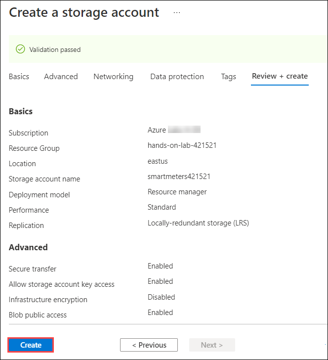
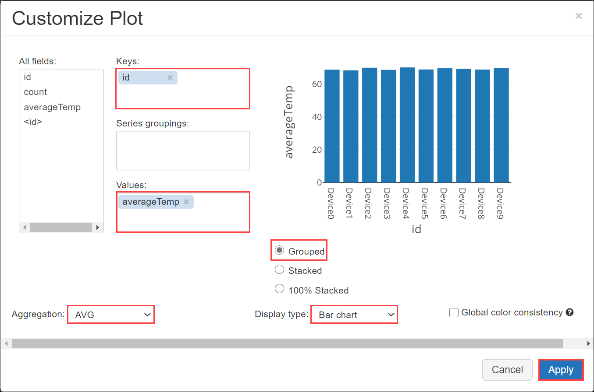

## Exercise 4: Cold path data processing with Azure Databricks

Duration: 60 minutes

Fabrikam would like to be able to capture all the "cold" data into scalable storage so that they can summarize it periodically using a Spark SQL query.

### Task 1: Create a Storage account

1. In the [Azure portal](https://portal.azure.com), select **+ Create a resource**, enter `storage account` into the **Search the Marketplace** box, select **Storage account** from the results, and select **Create**.

   

2. In the **Create storage account** on the **Basics** tab, enter the following:

   - **Subscription**: Select the subscription you are using for this hands-on lab.
   - **Resource group**: Choose Use existing and select the **hands-on-lab-SUFFIX** resource group.
   - **Storage account name**: Enter **smartmetersSUFFIX**.
   - **Location**: Select the location you are using for resources in this hands-on lab.
   - **Performance**: Select **Standard**.
   - **Redundancy**: Select **Locally-redundant storage (LRS)**.
   - Click on the **Advanced** tab.

   

3. In the **Advanced** tab, select the following:

   - **Secure transfer required**: Unchecked.
   - Click on **Review + create**.

   

4. Once validation has passed, select **Create**.

   

5. Once provisioned, navigate to your storage account, select **Access keys** from the left-hand menu, and copy the **key1** Key value into a text editor, such as Notepad, for later use.

   

### Task 2: Create the Stream Analytics job for cold path processing

To capture all metrics for the cold path, set up another Stream Analytics job that will write all events to Blob storage for analysis with Azure Databricks.

1. In the [Azure Portal](https://portal.azure.com), select **+ Create a resource**, enter `stream analytics job` into the **Search the Marketplace** box, select **Stream Analytics job** from the results, and select **Create**.

   

2. On the New Stream Analytics Job blade, enter the following:

   - **Job name**: Enter **cold-stream**.
   - **Subscription**: Select the subscription you are using for this hands-on lab.
   - **Resource group**: Select the **hands-on-lab-SUFFIX** resource group.
   - **Location**: Select the location you are using for resources in this hands-on lab.
   - **Hosting environment**: Select **Cloud**.
   - **Streaming units**: Drag the slider all the way to the left to select **1** streaming unit.
   - Select **Create**.

     

3. Once provisioned, navigate to your new **Stream Analytics job** in the portal.

4. On the **Stream Analytics job** blade, select **Inputs** from the left-hand menu, under **Job Topology**, then select **+Add stream input**, and select **IoT Hub** from the dropdown menu to add an input connected to your IoT Hub.

   

5. On the **New Input** blade, enter the following:

   - **Input alias**: Enter **iothub**.
   - Choose **Select IoT Hub from your subscriptions**.
   - **Subscription**: Select the subscription you are using for this hands-on lab.
   - **IoT Hub**: Select the **smartmeter-hub-SUFFIX** IoT Hub.
   - **Consumer Group**: Leave set to **\$Default**.
   - **Shared access policy name**: Select **service**.
   - **Endpoint**: Select **Messaging**.
   - **Partition key**: Keep empty.
   - **Event serialization format**: Select **JSON**.
   - **Encoding**: Select **UTF-8**.
   - **Event compression type**: Leave set to **None**.
   - Select **Save**.

     

6. Next, select **Outputs** from the left-hand menu, under **Job Topology**, and select **+ Add**, then select **Blob storage/ADLS Gen2** from the drop-down menu.

   

7. On the **Blob storage** output blade, enter the following:

   - **Output alias**: Set to **blobs**.
   - Choose **Select blob storage from your subscriptions**.
   - **Subscription**: Select the subscription you are using for this hands-on lab.
   - **Storage account**: Select the **smartmetersSUFFIX** storage account you created in the previous task.
   - **Container**: Choose **Create new** and enter **smartmeters**
   - **Authentication mode**: Select **Connection string**.
   - **Path pattern**: Enter **smartmeters/{date}/{time}**
   - **Date format**: Select **YYYY-DD-MM**.
   - **Time format**: Select **HH**.
   - **Event serialization format**: Select **CSV**, **comma (,)**
   - **Encoding**: Select **UTF-8**.
   - **Minimum rows**: Enter **100**.
   - **Maximum time**: Enter **5** Minutes.

     

     Select **Save**.

10. Next, select **Query** from the left-hand menu, under **Job Topology**.

    

11. In the **Query** text box, paste the following query.

    ```sql
    SELECT
          *
    INTO
          blobs
    FROM
          iothub
    ```

12. Select **Save query**, and **Yes** when prompted with the confirmation.

    

13. Return to the **Overview** blade on your **Stream Analytics job** and select **Start**.

    

14. In the **Start job** blade, select **Now** (the job will start processing messages from the current point in time onward) and click on **Start**.

    

15. Allow your Stream Analytics Job a few minutes to start.

16. Once the Stream Analytics Job has successfully started, verify that you are showing a non-zero amount of **Input Events** on the **Monitoring** chart on the **Overview** blade. You may need to reconnect your devices on the **Smart Meter Simulator** and let it run for a while to see the events.

    

### Task 3: Verify CSV files in blob storage

In this task, we are going to verify that the CSV file is being written to blob storage.

> **Note**: This can be done via Visual Studio or using the Azure portal. For this lab, we will perform the task using Visual Studio.

1. Within **Visual Studio** on your **Lab VM**, select the **View** menu, then select **Cloud Explorer**.

   

2. In **Cloud Explorer**, select **Account Management**, and connect to your Microsoft Azure Subscription.

   

> **Note:** If prompted, sign into your Azure account using your Azure credentials.

3. Allow Cloud Explorer about 30 seconds to load your subscription resources.

4. Expand your **Azure subscription**, then expand **Storage Accounts**, expand the **smartmetersSUFFIX** storage account, then expand the **Blob containers** node, then right-click the **smartmeters** container, and select **Open**. It may take a few moments to load your storage accounts.

   

5. Verify files are being written to Blob storage (the files should be located underneath the **smartmeters** container).

   

### Task 4: Process with Spark SQL

In this task, you will create a new Databricks notebook to perform some processing and visualization of the cold path data using Spark.

> **Note**: The complete Databricks notebook can be found in the Databricks-notebook folder of the GitHub repo associated with this hands-on lab, should you need to reference it for troubleshooting.

1. In the [Azure portal](https://portal.azure.com), navigate to the **Azure Databricks** resource you created in the [Before the hands-on lab setup guide](./Before%20the%20HOL%20-%20Internet%20of%20Things.md) exercises, and select **Launch Workspace**.

   

2. On the **Azure Databricks** landing page, create a new notebook by selecting **New Notebook** under **Common Tasks**.

   

3. In the **Create Notebook** dialog, enter `smartmeters` as the **Name** and select **Python** as the **Language**, then select **Create**.

   

    > **Note**: If your cluster is stopped, you can select the down arrow next to your attached cluster name, and select Start Cluster from the menu, then select Confirm when prompted.

4. In the **first cell** of your **Databricks notebook** (referred to as a paragraph in notebook jargon), enter the following **Python code** that creates widgets in the notebook for entering your **Azure storage account name** and **key**.

   ```python
   # Create widgets for storage account name and key
   dbutils.widgets.text("accountName", "", "Account Name")
   dbutils.widgets.text("accountKey", "", "Account Key")
   ```

    > **Note**:  Make sure to be aware of any indents\tabs. Python  treats indents\tabs with specific syntactical meaning.

5. Now, select the **Run** button on the right side of the cell and select **Run cell**.

   

6. When the cell finishes executing, you will see the **Account Key** and **Account Name** widgets appear at the top of the notebook, just below the toolbar.

   

7. You will also notice a message at the bottom of the cell, indicating that the cell execution completed, and the amount of time it took.

   

8. Enter your **Azure Storage account key** into the **Account Key widget text box**, and your **Azure storage account name** into the **Account Name widget text box**. These values can be obtained from the **Access keys** blade in your storage account.

    

9. At the bottom of the **first cell**, select the **+** button to insert a new cell below it.

    

10. In the **new cell**, paste the following code that will assign the values you entered into the widgets you created above into variables that will be used throughout the notebook.

    ```python
    # Get values entered into widgets
    accountName = dbutils.widgets.get("accountName")
    accountKey = dbutils.widgets.get("accountKey")
    ```

11. Run the cell.

12. **Insert a new cell** into the notebook, and paste the following code to mount your blob storage account into Databricks File System (DBFS), then **run** the cell.

    ```python
    # Mount the blob storage account at /mnt/smartmeters. This assumes your container name is smartmeters, and you have a folder named smartmeters within that container, as specified in the exercises above.
    if not any(mount.mountPoint == '/mnt/smartmeters' for mount in dbutils.fs.mounts()): 
      dbutils.fs.mount(
      source = "wasbs://smartmeters@" + accountName + ".blob.core.windows.net/smartmeters",
      mount_point = "/mnt/smartmeters",
      extra_configs = {"fs.azure.account.key." + accountName + ".blob.core.windows.net": accountKey})
    ```

    > **Note**: Mounting Azure Blob storage directly to DBFS allows you to access files as if they were on the local file system. Once your blob storage account is mounted, you can access them with Databricks Utilities, `dbutils.fs` commands.

13. **Insert a new cell** and paste the code below to see how **dbutils.fs.ls** can be used to list the files and folders directly below the **smartmeters** folder.

    ```python
    # Inspect the file structure
    display(dbutils.fs.ls("/mnt/smartmeters/"))
    ```

14. **Run** the cell.

15. You know from inspecting the files in the storage container that the files are contained within a folder structure resembling, **smartmeters/YYYY-DD-MM/HH**. You can use wildcards to obfuscate the date and hour folders, as well as the file names, and access all the files in all the folders. **Insert another cell** into the notebook, paste the following code, and **run** the cell to load the data from the files in blob storage into a **Databricks Dataframe**.

    ```python
    # Create a Dataframe containing data from all the files in blob storage, regardless of the folder they are located within.
    df = spark.read.options(header='true', inferSchema='true').csv("dbfs:/mnt/smartmeters/*/*/*.csv",header=True)
    print(df.dtypes)
    ```

    > **Note**: In some rare cases, you may receive an error that the **dbfs:/mnt/smartmeters/\*/\*/\*.csv** path is incorrect. If this happens, change the path in the cell to the following: **dbfs:/mnt/smartmeters/\*/\*/\*/\*/\*.csv**

16. The cell above also outputs the value of the **df.dtypes** property, which is a list of the data types of the columns added to the **Dataframe**, similar to the following:

    

    >**Note**: Do not worry if any of the time columns in the output are represented as `string`s, rather than `timestamp`s. It is simple to perform this cast if you need to. 

17. **Insert another cell** and run the following code to view the first 10 records contained in the **Dataframe**.

    ```python
    df.show(10)
    ```

18. Now, you can save the **Dataframe** to a **global table** in **Databricks**. This will make the table accessible to all users and clusters in your Databricks workspace. **Insert a new cell** and **run** the following code.

    ```python
    df.write.mode("overwrite").saveAsTable("SmartMeters")
    ```

19. Now, you will use the `%sql` magic command to change the language of the next cell to **SQL** from the notebook's default language, Python, then execute a SQL command to aggregate the SmartMeter data by average temperature. Paste the following code into **a new cell**, and **run** the cell.

    ```sql
    %sql
    SELECT id, COUNT(*) AS count, AVG(temp) AS averageTemp FROM SmartMeters GROUP BY id ORDER BY id
    ```

20. The output from the SQL command should resemble the following table:

    

21. Now, execute the same command in **a new cell**, this time using **Spark SQL** so you can save the summary data into a Dataframe. Copy and **execute** the following code into **a new cell**:

    ```python
    # Query the table to create a Dataframe containing the summary
    summary = spark.sql("SELECT id, COUNT(*) AS count, AVG(temp) AS averageTemp FROM SmartMeters GROUP BY id ORDER BY id")

    # Save the new pre-computed table
    summary.write.mode("overwrite").saveAsTable("DeviceSummary")
    ```

22. Next, query from this summary table by **executing** the following query in **a new cell**:

    ```sql
    %sql
    SELECT * FROM DeviceSummary
    ```

23. **Below** the results table, notice the area to change the visualization for the tabular output. Expand the **Chart** menu and choose the **Bar** option.

    

24. With the Bar chart visualization chosen, a **Plot Options..** button appears. Select **Plot Options..** and in the **Customize Plot** dialog, ensure the following are set:

    - **Keys**: **id**
    - **Values**: **averageTemp**
    - **Aggregation**: Select **AVG**.
    - Select **Grouped** as the chart type.
    - **Display type**: Select **Bar chart**.
    - Click on **Apply**.

      

25. Observe the results graphed as a column chart, where each column represents a device's average temperature.

    

26. Click on the **Next** button present in the bottom-right corner of this lab guide.
